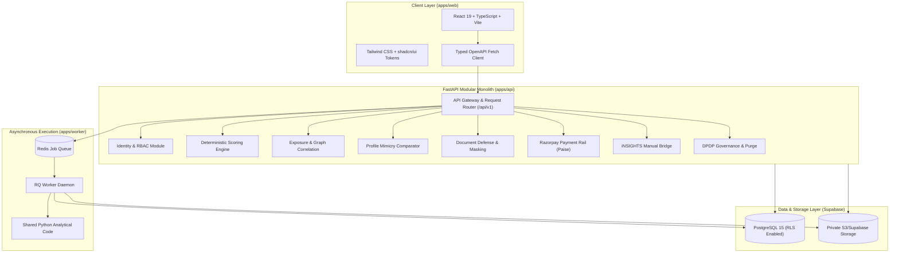
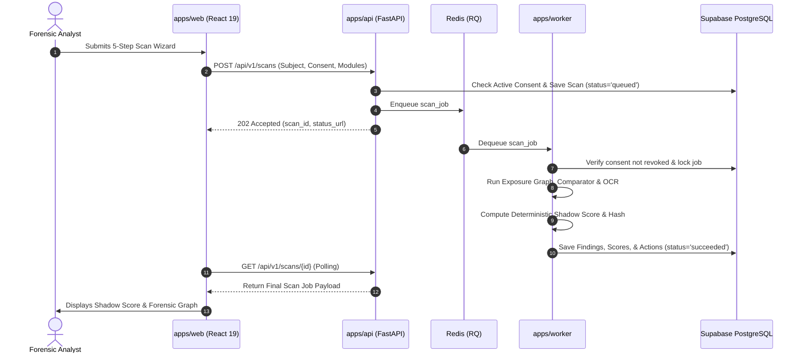

# ShadowID — Master Architecture & Technical Specification

> **Platform:** ShadowID (“What You Share Is More Than What You See.”)  
> **Team GIGABYTE:** Anshul, Tanishq, and Himank  
> **Initiative:** Build With Bharat 3.0, Chitkara University, Himachal Pradesh  
> **Focus:** India-first digital footprint exposure analysis, impersonation detection, and document defense with global expandability.

---

## 1. System Overview

ShadowID is built as a **Modular Monolith** engineered to provide deterministic, explainable, and privacy-preserving forensic identity insights without intrusive unconsented web scraping or black-box predictions.

---

## 2. Core Modules

### 2.1 Exposure Intelligence
- **Objective:** Ingest consented, supplied evidence tokens (developer handles, telecom identifiers, academic and professional affiliations).
- **Graph Construction:** Builds deterministic multi-vector graph with explicit node types (`identity`, `handle`, `telecom`, `employer`, `document`) and reasoned relation edges (`same_handle`, `leaked_in`, `associated_with`, `contradicts`).
- **Conservative Merging:** Preserves contradiction flags; common names or shared cities alone never merge independent identities.

### 2.2 Impersonation Intelligence
- **Objective:** Compares an authorized reference profile against suspicious candidate links.
- **Signals:** Word-token overlap ($J_{\text{name}}$), handle character distance ($S_{\text{handle}}$), bio text similarity ($J_{\text{bio}}$), and perceptual image hash match ($H_{\text{avatar}}$).
- **Classification:** Heuristic outcomes strictly bounded to:
  - `Limited overlap` (benign namesakes with divergent context)
  - `Similarities found` (partial lexical overlap requiring review)
  - `Needs review` (recycled avatar and bio funneling to unverified payment rails)
  - `Insufficient evidence` (lacking candidate parameters)

### 2.3 Document Defense & OCR
- **Objective:** Structural and typographical anomaly detection on sample Indian ID categories (Aadhaar, PAN, Passport).
- **Pipeline:** Validated upload $\to$ OpenCV morphology & blur analysis (Laplacian index) $\to$ Tesseract English/Hindi OCR $\to$ layout geometry consistency $\to$ PII masking (`•••• •••• 9021`, `ABCPS••••D`).
- **Verdicts:** `No configured inconsistencies found`, `Requires review`, or `Insufficient image quality`. Does not claim issuer registry verification.

### 2.4 Deterministic Shadow Score
- **Formula:**
  $$\text{score} = \text{round}\left(\frac{\sum_{i \in A} w_i \cdot c_i}{\sum_{i \in A} w_i}\right)$$
  $$\text{coverage} = \text{round}\left(100 \cdot \sum_{i \in A} w_i\right)$$
- **Prototype Weights:**
  - Exposure sensitivity: $35\%$
  - Cross-source connectability: $25\%$
  - Impersonation indicators: $25\%$
  - Document anomaly signals: $15\%$
- **Provisional Logic:** Incomplete coverage yields a clearly labeled provisional score and explicit omission reasons. Empty evidence returns null (`Insufficient evidence`).
- **Snapshot Hash:** Immutable SHA-256 digest generated from calculation inputs.

---

## 3. RBAC Permission Matrix

| Capability | Owner | Analyst | Viewer |
| :--- | :---: | :---: | :---: |
| Workspace Membership & Roles | Yes | No | No |
| Billing & Entitlement Upgrades | Yes | No | No |
| Data Retention & DPDP Purge | Yes | No | No |
| Submit Evidence & Register Subjects | Yes | Yes | No |
| Launch Scans & Trigger Worker Jobs | Yes | Yes | No |
| Review Documents & Impersonation Decisions | Yes | Yes | No |
| View Scans, Graphs, & Findings | Yes | Yes | Yes |
| Export Forensic JSON & PDF Dossiers | Yes | Yes | Yes |

---

## 4. Sequence Diagram: Scan Execution Lifecycle

