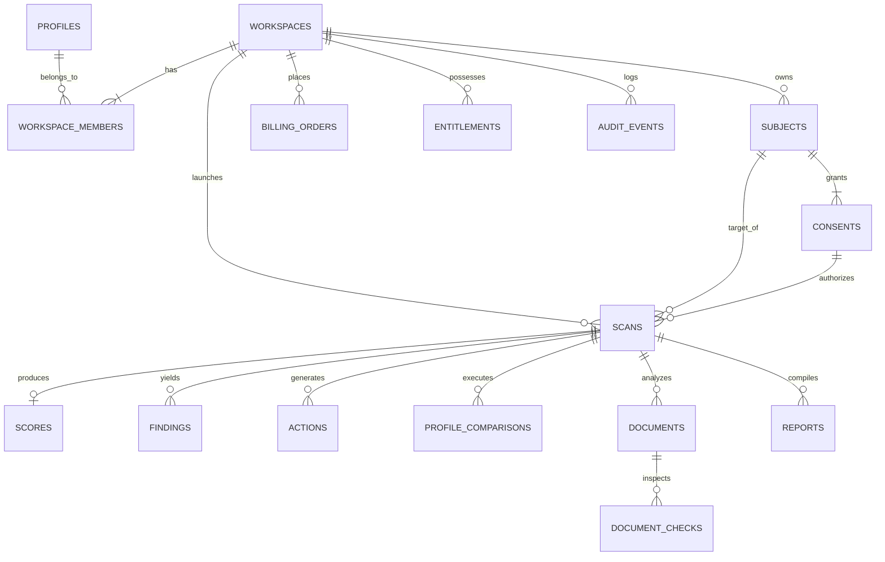

# ShadowID — Database Schema & Data Dictionary

> **Database:** PostgreSQL 15 (Supabase Managed / Local Instance)  
> **Tenant Key:** `workspace_id` enforced on all tenant tables with composite foreign keys  
> **Security:** PostgreSQL Row Level Security (RLS) enabled on all exposed tables

---

## 1. Entity-Relationship (ER) Overview

---

## 2. Data Dictionary

### 2.1 `profiles`
Represents individual user identities linked to Supabase Auth.
- `id` (UUID, PK): Unique profile identifier.
- `auth_user_id` (UUID, Unique): Foreign reference to Supabase `auth.users.id`.
- `email` (TEXT, Not Null): User primary contact email.
- `full_name` (TEXT, Not Null): User display name.
- `created_at` (TIMESTAMPTZ): Profile creation timestamp in UTC.

### 2.2 `workspaces`
Multi-tenant organizational boundary.
- `id` (UUID, PK): Unique workspace identifier.
- `name` (TEXT, Not Null): Organization or project name.
- `tier` (TEXT, Not Null): Subscription tier (`free`, `pro`, `enterprise`).
- `retention_days` (INT, Not Null): DPDP data retention window (default `30` days).
- `created_by` (UUID, FK -> profiles.id): Workspace creator profile.

### 2.3 `subjects`
Target individuals evaluated under consented assessment scopes.
- `id` (UUID, PK): Unique subject identifier.
- `workspace_id` (UUID, FK -> workspaces.id): Owning tenant.
- `name` (TEXT, Not Null): Full legal or declared name.
- `city` (TEXT, Not Null): Primary Indian city/district.
- `state` (TEXT, Not Null): Indian State or Union Territory.
- `institution` (TEXT, Nullable): University, college, or academic body.
- `employer` (TEXT, Nullable): Declared employer organization.
- `primary_handle` (TEXT, Nullable): Primary online handle (e.g. `@arun_sharma_99`).
- `is_synthetic` (BOOLEAN, Not Null): Marker for demo/fixture datasets.

### 2.4 `consents`
Digital Personal Data Protection (DPDP) Act explicit consent records.
- `id` (UUID, PK): Unique consent audit identifier.
- `workspace_id` (UUID, FK -> workspaces.id): Owning tenant.
- `subject_id` (UUID, FK -> subjects.id): Consenting subject.
- `purpose` (TEXT, Not Null): Specific declared evaluation purpose.
- `permitted_modules` (TEXT[], Not Null): Array of authorized analysis engines (`exposure`, `impersonation`, `documents`, `research`).
- `authorization_basis` (TEXT, Not Null): Legal basis (`self`, `authorized_representative`, `synthetic_demo`).
- `retention_days` (INT, Not Null): Approved retention window.
- `is_revoked` (BOOLEAN, Not Null): Active consent status.
- `revoked_at` (TIMESTAMPTZ, Nullable): Revocation audit timestamp.

### 2.5 `scans` & `scan_jobs`
Assessment job orchestration and durable outbox state machine.
- `id` (UUID, PK): Unique scan execution record.
- `workspace_id` (UUID, FK -> workspaces.id): Owning tenant.
- `subject_id` (UUID, FK -> subjects.id): Target subject.
- `status` (TEXT, Not Null): State machine (`queued`, `running`, `succeeded`, `partial`, `failed`, `cancelled`).
- `progress_percent` (INT, Not Null): Measured work progress [0, 100].
- `queued_at` (TIMESTAMPTZ): Queue admission timestamp.
- `completed_at` (TIMESTAMPTZ, Nullable): Job completion timestamp.

### 2.6 `scores`
Immutable mathematical synthesis of multi-vector analytical findings.
- `id` (UUID, PK): Unique score snapshot.
- `workspace_id` (UUID, FK -> workspaces.id): Owning tenant.
- `scan_id` (UUID, Unique, FK -> scans.id): Associated scan.
- `score` (INT, Nullable): Calculated Shadow Score [0, 100], or NULL if unassessed.
- `coverage` (INT, Not Null): Assessed module weight percentage [0, 100].
- `is_provisional` (BOOLEAN, Not Null): Indicates coverage < 100%.
- `provisional_reason` (TEXT, Nullable): Explanation of omitted modules.
- `severity_band` (TEXT, Not Null): Display band (`lower`, `moderate`, `elevated`, `high`).
- `weights` (JSONB, Not Null): Immutable weights snapshot ({exposure: 0.35, connectability: 0.25, impersonation: 0.25, document_anomaly: 0.15}).
- `contributions` (JSONB, Not Null): Reconciled point contribution breakdown.
- `input_snapshot_hash` (TEXT, Not Null): Cryptographic SHA-256 digest of calculation inputs.

### 2.7 `documents` & `document_checks`
Optical consistency and OCR verification artifacts.
- `id` (UUID, PK): Document record.
- `document_category` (TEXT, Not Null): Category (`Aadhaar`, `PAN`, `Passport`, `Generic ID`).
- `filename` (TEXT, Not Null): Uploaded or sample file name.
- `quality_score` (INT, Not Null): OpenCV blur and glare score [0, 100].
- `verdict` (TEXT, Not Null): Outcome (`Requires review`, `No configured inconsistencies found`, `Insufficient image quality`).
- `inconsistencies` (TEXT[], Not Null): Array of detected typography or baseline anomalies.
- `is_human_verified` (BOOLEAN, Not Null): Analyst attestation state.

### 2.8 `billing_orders`
Indian payment rail records persisted in integer paise.
- `id` (UUID, PK): Internal billing transaction.
- `workspace_id` (UUID, FK -> workspaces.id): Billed workspace.
- `razorpay_order_id` (TEXT, Unique, Not Null): Razorpay order reference.
- `razorpay_payment_id` (TEXT, Nullable): Captured payment ID.
- `amount_paise` (INT, Not Null): Transaction value in paise (e.g. `49900` for ₹499.00).
- `currency` (TEXT, Not Null): Currency ISO code (`INR`).
- `status` (TEXT, Not Null): State (`created`, `attempted`, `paid`, `failed`, `refunded`).

### 2.9 `audit_events`
Tamper-proof, append-only security and compliance audit trail.
- `id` (UUID, PK): Audit event entry.
- `workspace_id` (UUID, FK -> workspaces.id): Associated tenant.
- `actor_profile_id` (UUID, FK -> profiles.id): Acting user profile.
- `action` (TEXT, Not Null): Action performed (`scan.created`, `consent.revoked`, `document.reviewed`).
- `entity_type` (TEXT, Not Null): Target entity table.
- `entity_id` (UUID, Not Null): Target record ID.
- `created_at` (TIMESTAMPTZ): Immutable event timestamp.
